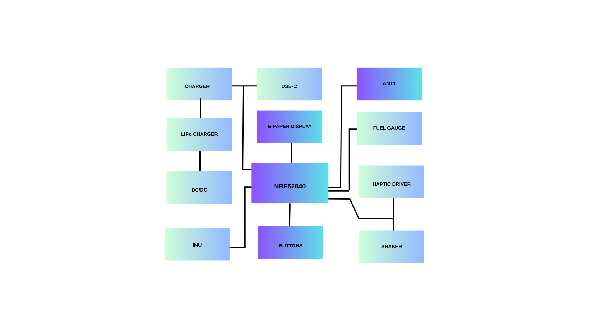

# Documentatie Hardware - Proiect Wearable / Smartwatch nRF52840

## 1. Diagrama Bloc

Diagrama ilustreaza doua fluxuri principale:
*   **Fluxul de Alimentare:** De la portul USB-C, prin circuitul de incarcare, catre baterie si apoi prin convertorul DC/DC catre restul componentelor.
*   **Fluxul de Date/Control:** Centrat pe microcontrolerul nRF52840, care comunica cu senzorii, display-ul.

---

## 2. Bill of Materials (BOM)

Tabelul de mai jos contine modulele principale folosite in proiect, impreuna cu link-uri pentru achizitie si specificatii tehnice.

| Nume produs | Ref | Link achizitionare | Datasheet |
| :--- | :--- | :--- | :--- |
| **nRF52840-QIAA** | U1 | [Component Search Engine](https://componentsearchengine.com/part-view/NRF52840-QIAA-R/Nordic%20Semiconductor) | [Datasheet](https://4donline.ihs.com/images/VipMasterIC/IC/NRSA/NRSA-S-A0021008244/NRSA-S-A0021008244-1.pdf?hkey=61A2E4C270F0397D049F8F05BD4F1054) |
| **BQ25180YBGR** | IC1 | [Component Search Engine](https://componentsearchengine.com/search?term=BQ25180YBGR) | [Datasheet](https://analytics.supplyframe.com/trackingservlet/track/?r=0x34EY99PS_gIu2qWuzU9_U842M9-un2szqNoXX0OQ9lqbiEKGN3BJ73jgvlrgiXR89Peb0evqc4GXoUXllBhv0EBbS6IvP2J9XlK2jP2A6stFn-y2dC_JwPYaasEzx0O-vxRsHrvjDMttJo6_R4oFWH3JMP3HPT3L-Nznne1h3KEsMXPl-eGs-pMLJ6GfjQCQ6HQMtq6htuNY6F9LyUZPlBJcp1K0CY8wZlcmYWeP3d00EKGkwMEYVuhGukZlpk9s5eB2sCQiAmMMBIBl2JypaU6-1_JfgzrT5bvUUGSdkUqZVMi7lvw7V03cGienT9feVSRMBhhWaNFGhzf6_3f8ZFIsqpCB6RNiXgzOy4UCL8GWfRIZFBGLsZvpqmkT4iLPnvXUrdv-uMDsMargLsNudyjFN55qoFIoM_lHR3jfZiBrXHrx7fYI1m3zFYuPc18lUM4dLxlLjbOFrCL0NYDVpEveG92dFwHfnYbXQgvjrXr2rAOwFVNwEcAFSYk5ktGr0AZVSeLG20ATU9f5Ua1VPDIn7dlK_upDe2HQ7ZnA50hRZ6l5EHTT1TR6mV6zah) |
| **DRV2605YZFR** | IC2 | [Component Search Engine](https://componentsearchengine.com/search?term=DRV2605YZFR) | [Datasheet](https://analytics.supplyframe.com/trackingservlet/track/?r=0x34EY99PS_gIu2qWuzU9_U842M9-un2szqNoXX0OQ9lqbiEKGN3BJ73jgvlrgiXR89Peb0evqc4GXoUXllBhv0EBbS6IvP2J9XlK2jP2A5_GZUU6ZJYL2OifsViLlEfO-vxRsHrvjDMttJo6_R4oFWH3JMP3HPT3L-Nznne1h3KEsMXPl-eGs-pMLJ6GfjQCQ6HQMtq6htuNY6F9LyUZPlBJcp1K0CY8wZlcmYWeP0ge5YXjaukObe0lIq9YZ1Y9s5eB2sCQiAmMMBIBl2JytG3z6cPnGe-cmO7h9dQIJ2kzUBKYJ3kKq1ql5kAIW4INEEo_wOFAtAhver6Q6kuIfVofA0tjpG_oIZ517f4Vb78GWfRIZFBGLsZvpqmkT4iLPnvXUrdv-uMDsMargLsNnX2hKYawPQ2D7SudtAUHHtiBrXHrx7fYI1m3zFYuPc18lUM4dLxlLjbOFrCL0NYDVpEveG92dFwHfnYbXQgvjrXr2rAOwFVNwEcAFSYk5ktqoT45GaC_RMx31tbcd0eeVPDIn7dlK_upDe2HQ7ZnA50hRZ6l5EHTT1TR6mV6zah) |
| **BMA423** | IC3 | [Component Search Engine](https://componentsearchengine.com/search?term=bma423) | [Datasheet](https://analytics.supplyframe.com/trackingservlet/track/?r=0x34EY99PS_gIu2qWuzU9_U842M9-un2szqNoXX0OQ9lqbiEKGN3BJ73jgvlrgiXR89Peb0evqc4GXoUXllBhv0EBbS6IvP2J9XlK2jP2A65Hh8cz60QZRR0eH2YQezA3QFuEZVrF44_bcvGN_lyh23KGb2OV452gy8_0y5ECrz838JB1AXz4HlagHjHKK0zIVUI_nXq20DP4qZVoZkXjzWM81fZaYscHPt3_tBNEt3RrwddE0Gz5nohvYrd6gxYc3LSeSqEPukqMV5glPuL1CNaI1kVMusAxJjzUp0G6CswwJW_ssfKVIHLQT-IJeMMwbXLDJpduD2PNPjtLS0y1srGxUCiKdKyCV91htNfRSMP3qWp9KAByolyr1E2K_PZ5B6aRPZ6alq5MnvhLx7KzpSpvK4vdnUllhspAmNRIPTvgHjblUHXdwUjCbyASDYb9MYvdijqaUwAnHrJsf3zmbjzHXjtwLXVovtyhuM6e6Ynw7vpRUSsWu0xJF95B32liScqep17qvTwnJG7pQnxHSR6-2eSgXb3qFP3Jk0Oamw51BA5ruLDXxwczn9SmJ5bdh_kmzVEzIYo-AC-eZSsAdcBnfKHuYtpsSdnOr0On6uXkGbg_xWe6X4FW8arIIpH) |
| **RT6160AWSC** | IC9 | [Component Search Engine](https://componentsearchengine.com/part-view/RT6160AWSC/RICHTEK) | [Datasheet](https://analytics.supplyframe.com/trackingservlet/track/?r=0x34EY99PS_gIu2qWuzU9_U842M9-un2szqNoXX0OQ9lqbiEKGN3BJ73jgvlrgiXR89Peb0evqc4GXoUXllBhv0EBbS6IvP2J9XlK2jP2A7oxjHvu3vjqv4WxQoBIehIpFdNxUOLInPyEkIhtPddHwvaXQpBCG-4NPHWS8Luf9PDHBq8VAfKRDCu-t4VKkJgw0q36_CHuXBQmQUFy7_kW1dsUOzQneFlP07hp6tEqIRtrF0F5Zb_nR1t-hLLccIBUGxWBuEpEl7kUFZ6dE5hS-7kEI0Imii-UkRj2fTw2ElN8-A1nBG9hKzVKn06I4IowPKk5xXTOIwLAB724T4UUPVC2PjCMrZrSZdNsHPTjWe6k3zgMkqRJAhHbiU-gTTV8piVEtXZSzcLQMzYFvj83r7hfL_VtnnBJVZtCWXJKkLcTeL-qC6Kw-bbZFGwqn1eTorqzedjC01O_9x4TSWbk5yQDrvZUK-iGRXtGqr6qwa0P7iXpgr0HPlvis6ez45oylOW77ENVj4BRgrI885Q_XvOL-xgY1EhwCaKTrd3oN5is0EaxHlNGM4zz0QyxhvBvl-geXlL_R-njMpWcd0RKFtHWMev1NGVlnzxgiu0SjMG-5Cr55kPMae_7V9Vf5dfvXk1u41AF-eDZgjn1NFilA) |
| **MAX17048G+** | U3 | [Component Search Engine](https://componentsearchengine.com/part-view/MAX17048G%2B/Analog%20Devices) | [Datasheet](https://analytics.supplyframe.com/trackingservlet/track/?r=0x34EY99PS_gIu2qWuzU9_U842M9-un2szqNoXX0OQ9lqbiEKGN3BJ73jgvlrgiXR89Peb0evqc4GXoUXllBhv0EBbS6IvP2J9XlK2jP2A6DXbvJdRmZW2yJtFQ1_uB8CpVVRsuy5H3f7RjpWY5KE02ZSejBQ-1sTThh8ZhaVmPyvNMTfmvWqPHCxujzIU_9L5QMgSVsWqB7UcVIWqkZMCBUsKvx5VN_Ff7UgqURIux-A-P-bJZx2uYoMIaFEdYZKxLQSmqRADJVv0bC3pADlsMXLGPj7wuD_4oozecdZ0K-8Axqnk-A4H62ngUFyJ-u_KU29-JDjkr_a4X5kD-SwJaXo8CyXJYulMKyYA9Ww-0YTP0WJ4WexDOETYGOo7QYWrTP3cuO2jaBxtmnP_QmXvwZZ9EhkUEYuxm-mqaRPiIs-e9dSt2_64wOwxquAuw2wbj8YtdMq1G5JGMGXucSqWIGtcevHt9gjWbfMVi49zXyVQzh0vGUuNs4WsIvQ1gNWkS94b3Z0XAd-dhtdCC-OtevasA7AVU3ARwAVJiTmS3yOHNszfnmm1dqoJi-2CiH_5iJolc-gxDtjl0RWrOjUc2y34iccbFKo6BQ_BAC8ZA) |
| **USB4105-GF-A** | J4 | [SnapMagic](https://www.snapeda.com/parts/USB4105-GF-A/GCT/view-part/?ref=search&t=USB4105-GF-A&ab_test_case=b) | [Datasheet](https://www.snapeda.com/parts/USB4105-GF-A/GCT/datasheet/) |
| **503480-2400** | J1 | [Component Search Engine](https://componentsearchengine.com/part-view/503480-2400/Molex) | [Datasheet](https://analytics.supplyframe.com/trackingservlet/track/?r=0x34EY99PS_gIu2qWuzU9_U842M9-un2szqNoXX0OQ9lqbiEKGN3BJ73jgvlrgiXR89Peb0evqc4GXoUXllBhv0EBbS6IvP2J9XlK2jP2A4bhBcp5m93QVvXq-b4ZvXprUYNzIdppOCDGuJ7aDflaky8671aiqchDLLtbVjC9xdCaJJ6nF0pYtLKaCopUVPbENE6D3pzXoxhUvdbzuW6oJXfd1FVm63N6SPCyX6r1R5v9WVM0GlwVZLnxlj5hrMZy4odeEzEID3f9KwH_MHnqtKpOLWlH5R74gzWY8AYOo5GMjISf0eMdYvE6MODW1eb4kLz15caNHBYeIVK5MK9qSpUczJXWYrJFJGp6PnnEax_T5A32QcD4zvMW-ssnnZd4OhSZlAx9pe7i1e8hrw58wOHOyfVNVOXSLomvqnUeGmBnnj8VHAk7jgVz6Pxql9q4VLXOsw1zGQSjIjD0YczTpyQDrvZUK-iGRXtGqr6qwa0P7iXpgr0HPlvis6ez45oYMjPU0esZvj56AyDu6TV43vOL-xgY1EhwCaKTrd3oN5is0EaxHlNGM4zz0QyxhvBvl-geXlL_R-njMpWcd0RKFtHWMev1NGVlnzxgiu0SjM64VUgM7uRV37HYPQ2vpo0llXHrUb_2BeaRI1zgnEpSA) |
| **EVP-AKE31A** | SW_x | [Component Search Engine](https://componentsearchengine.com/part-view/EVPAKE31A/Panasonic) | [Datasheet](https://analytics.supplyframe.com/trackingservlet/track/?r=0x34EY99PS_gIu2qWuzU9_U842M9-un2szqNoXX0OQ9lqbiEKGN3BJ73jgvlrgiXR89Peb0evqc4GXoUXllBhv0EBbS6IvP2J9XlK2jP2A7jRNlQCGFKUCB9Om2oIPVb8wB-QC4Y0LpnCr5Xq_ByDC5GEiqgkeKxStY5Iu4CVibuldEG2BjB5lNvto04wXg8jGQATYHCL6DopdSbrdwi56E6tw2YzEoN2JK_GY31dBUUo3LDYzCtu7wIFWHSy5ldFUMm7nZxbAbVY0l3I7ewOZYX363B6_l_RD2rR4C4K-my9KZLIZBsuzkxb3A5MS3NsEKKVZJUvtL97I9b8a5mIzliD9eDRpt3ctCvjuas-AASRFTRlsq83k9cscG5Zi-TsUcA-0LBtlakk22B3qKjpagoB0KIBYTkXeQHEqE58jyRQGb7iM-fmdBd-zqmHjtKd_NmoHXgB5duqrDZJlY4H5yQDrvZUK-iGRXtGqr6qwa0P7iXpgr0HPlvis6ez45o2VHowPjIDZTEf8wGRQ4ci3vOL-xgY1EhwCaKTrd3oN5is0EaxHlNGM4zz0QyxhvBvl-geXlL_R-njMpWcd0RKFtHWMev1NGVlnzxgiu0SjOjOFfjEDKuI85CkEY44YiXAqRNgBm1QPZfXRUNd55gVA) |
| **2450AT18B100E** | ANT1 | [Component Search Engine](https://componentsearchengine.com/part-view/2450AT18B100E/JOHANSON%20TECHNOLOGY) | [Datasheet](https://analytics.supplyframe.com/trackingservlet/track/?r=0x34EY99PS_gIu2qWuzU9_U842M9-un2szqNoXX0OQ9lqbiEKGN3BJ73jgvlrgiXR89Peb0evqc4GXoUXllBhv0EBbS6IvP2J9XlK2jP2A5CBZpEZS1QpXV8FFu44G8mfHuYmg61LS2zWxuqTvB9fpXV375gtD9bFmcCH2H2-DAuRhIqoJHisUrWOSLuAlYmG3OIjmksJ1dRyGU5ZtR5ygKEZn7IXrj9HCDF2qCHjmkMrQBkA8LW1ZVPP8ECLfGEq3PUbV5s03lneGIiPby_jK-PplrsL5DHOAlCUT_Isuz2zl4HawJCICYwwEgGXYnKR7O9_Lww0zeRhLdSHLfmKLGvvXkZ69BbN2cqUVuLZwWkzHNmVRqmDRdD2bTu63RwJxUArrnlVYIvOowP0A2ooJyQDrvZUK-iGRXtGqr6qwa0P7iXpgr0HPlvis6ez45oA6DbeayHRodKseYDStLS-HvOL-xgY1EhwCaKTrd3oN5is0EaxHlNGM4zz0QyxhvBvl-geXlL_R-njMpWcd0RKFtHWMev1NGVlnzxgiu0SjN1C5tMR-D4l4QIlPKj2IZ-Yy9VWewJTIBnNBaBqDAucmok7ZMY6ahHbaLYDtLSQSg) |
| **02016D105KAT4A** | Cap | [Component Search Engine](https://componentsearchengine.com/part-view/02016D105KAT4A/Kyocera%20AVX) | [Datasheet](https://analytics.supplyframe.com/trackingservlet/track/?r=0x34EY99PS_gIu2qWuzU9_U842M9-un2szqNoXX0OQ9lqbiEKGN3BJ73jgvlrgiXR89Peb0evqc4GXoUXllBhv0EBbS6IvP2J9XlK2jP2A7nZAqH6w5fKchKrnD5jWCWB9uu1cFEpsbINa2EvY3xALGo-iAVS7h3PyuKIuP0uNZtyhm9jleOdoMvP9MuRAq8_N_CQdQF8-B5WoB4xyitMyFVCP516ttAz-KmVaGZF481jPNX2WmLHBz7d_7QTRLdwdqbPKSozx2UncdATv8f8tXMySboAvDMsIjBRKwEr_Q2jLNScnH_dLxDrjv1EkHNMMCVv7LHylSBy0E_iCXjDMG1ywyaXbg9jzT47S0tMtbKxsVAoinSsglfdYbTX0UjdS3r3VBQI1vaml90w1YXmOZwvE2zhk6aceLOkr7DbpYy5Q4LxAI48xDMx_XnZmHh_fuDZ1JjOvgaKgrvl3RWpnkNWF_MCUOTM_XXPqM7bQP8GWfRIZFBGLsZvpqmkT4iLPnvXUrdv-uMDsMargLsNqbHJnjKIKwWJs5Y8BBPlGdiBrXHrx7fYI1m3zFYuPc18lUM4dLxlLjbOFrCL0NYDVpEveG92dFwHfnYbXQgvjrXr2rAOwFVNwEcAFSYk5kt9N8XAFyUPAGbflqS7VyAcxuzNsnrGaIyGIlhKp9g4wTmDKwPnl8GHxC8271ufp6a) |
| **0402B472K500NT** | Cap | [Component Search Engine](https://componentsearchengine.com/part-view/0402B472K500NT/Guangdong%20Fenghua%20Advanced%20Tech) | [Datasheet](https://analytics.supplyframe.com/trackingservlet/track/?r=0x34EY99PS_gIu2qWuzU9_U842M9-un2szqNoXX0OQ9lqbiEKGN3BJ73jgvlrgiXR89Peb0evqc4GXoUXllBhv0EBbS6IvP2J9XlK2jP2A5dXweU-D0sdBl1Qjp1-TAk_mVbiV46egqumwUGPF1lPZOKh6TrHICN8puILsKgsK-sQYSYGHAdrwcZ8E3HkBuRqTzZoYvrcDuK6DczS8PHjtCeG-EZDmaKILRgGXnDovSJdSjTWfIdrOBLyjZVWwqbU8QHBZonHiX1ulf1ijnuV7zT-G6CvmssDKjz6ykjyiiOL6l3SGqOLFDw0gOobHbOqHuUYKiE61kjf205L08i3UM0rohfI1WiHrOQi4HMOm09cQB_Eb5GLgSyk-l9ROWJYnHwneW9h_i_wyqbadWvI2fq1mxS8j8a2gzW5h7Am3q22IuGOtCVzPmDh8SvQTkQ758gNK6-fDp2DK2st6xkFXHiipFVag1_ybNPdjfdaX1UzwWSBXnGX2GnGPz7GnffHFOReOLDLMKa5h6Mh-WEPbjzHXjtwLXVovtyhuM6e6bvcO-Aa1fTPjORUyGtfwzUiScqep17qvTwnJG7pQnxHSR6-2eSgXb3qFP3Jk0Oamw51BA5ruLDXxwczn9SmJ5bdh_kmzVEzIYo-AC-eZSsAe9gIh7dial-5XlJgFXLBC6nnoq1N-30oEqZ652mt86F5eSLo1vpaeRbZ2kk2sM_6fNceAboe8iJs_NcXwRFbjbfHFWQBRwq8Bz1Vz6F9ml2) |
| **0603N101Z160PHT** | Cap | [Component Search Engine](https://componentsearchengine.com/part-view/0603N101Z160PHT/Knowles) | [Datasheet](https://analytics.supplyframe.com/trackingservlet/track/?r=0x34EY99PS_gIu2qWuzU9_U842M9-un2szqNoXX0OQ9lqbiEKGN3BJ73jgvlrgiXR89Peb0evqc4GXoUXllBhv0EBbS6IvP2J9XlK2jP2A6bBUHyoIFXnx--EZGBFfQnKj-pGIWglMqjPvjnZMI1ROD-eFH0dQ5fGmWruxh3uWLiRxa5GVb1G8SarLAYvRwVCvh2rsM5Co0LiTQuRgHYQmR_Kw-WhaAp18Vd6BkulhiUYsFGfOjiEUo_G-gOSQISOb3asDTRa2nbQgBadcJRBn3xHAfo5WBcsZgsl-SCWdzDkyf7vNUEDwBZtcUDHi-uKY0hwe4a1bnvo8zMtwGo2MaC01xwDDOzSc4VyYfJSx1PmhpZFwWuDduo_rie84KN2CwC3n1Orhmp14oyntM5qhJlmUpo6uFqXElS5tKGkuIQjmR3i9tKd6_YkPcb9R46EjUq7dccUQLL8HwYZhkm03p4hv0lEuMHqdICzl8lNaNDQCtx65VM_jqpqYqe0JUmllCn3E-KeQ11zr8yAYxvqRTZ7oMUBpCdo4N39FcT7YRWXg_A396EZyMOfkdF4xaWlNX1rVIRRUxnnMVvpiJ9xJJy0_ZKSkvi3-FXIP0bgnv26jPEkRvUWmwZ5lajK99ISxh5QC76NAKNcG2MIA-8IA) |
| **MBR0530** | D_x | [Component Search Engine](https://componentsearchengine.com/part-view/MBR0530/MCC) | [Datasheet](https://analytics.supplyframe.com/trackingservlet/track/?r=0x34EY99PS_gIu2qWuzU9_U842M9-un2szqNoXX0OQ9lqbiEKGN3BJ73jgvlrgiXR89Peb0evqc4GXoUXllBhv0EBbS6IvP2J9XlK2jP2A7wO1xHkSqzgcdOiv4DyA6-KUE0hnO-8Oq0TiydnN6_P0wUQHFX21cOqvJTns1cls8glPBTBkJaHrq7uCkVkwGv-5pj5AVwFB9sB-wcL2FFgyWVm9T9cIRr8wx2IAUmRLrqcyqWpNEiSB4NqE89sevkbBDFmKOLKGgFGVXUbq7BdmiOYInF50iH-ZETGnBwi_rX5nalc0YozzZXH0Ho6mrv8yOBDBMkcmmw7t-R5Pp9YtrlefXbBe-6T8WCNg08grwHzDyjqT6SUcaAWVlKnh6bRiWE1TJKU_uvvFWX1OPSqvoIi470E_jmy5w33-r2mBKtQHk8z5wpru9bm3kq9Cy6uPMdeO3AtdWi-3KG4zp7pgB5vSuVZ0lZr58FJvreOv6JJyp6nXuq9PCckbulCfEdJHr7Z5KBdveoU_cmTQ5qbDnUEDmu4sNfHBzOf1KYnlt2H-SbNUTMhij4AL55lKwBuVAU7zPQxXbQZLEQMKWD6P2ReE9xXD9nOJFwSVA5qyg) |
| **USBLC6-2SC6Y** | D3 | [Component Search Engine](https://componentsearchengine.com/part-view/USBLC6-2SC6Y/STMicroelectronics) | [Datasheet](https://analytics.supplyframe.com/trackingservlet/track/?r=0x34EY99PS_gIu2qWuzU9_U842M9-un2szqNoXX0OQ9lqbiEKGN3BJ73jgvlrgiXR89Peb0evqc4GXoUXllBhv0EBbS6IvP2J9XlK2jP2A6dTUnJ4j6IQujKF6av25-uRn4mg0r6kCfWETOQX8TpiO3zYIcPoaq5tD5T48ppj9PKEsMXPl-eGs-pMLJ6GfjQDAOKFUEpEDhTaSRRNqlFXNPTmxA8IAfp4JgYg0H3dX0S2Rl5Z4YAKcDbbf2FiaTyJGaASMXUOk9RWMrzJNXv0e9LeTd8fSBTQIhQLd_oSdd4n35WM1T5BDS4jAG809kCU9qHdpI_P1FtEJcxAylr-UUxFk_RBQjjQqRh_5gqISyEbE4wKs2WMG7h72Ep3QaU6fJ-ZcDnJd5iSK_QW5dHq0HEicnlBgfQPpvg0syCaHmVKFwNUTFYIlDkTOzLnSyg14emPykRQ2HA1I7ujpckpIN2GnVYqOYsJ-lsbaAvme0sVyGrswj3lfibNR5l-0ftpPMQLSbextwMh8I3CKooxV56I7DBspNPCsMutOqdCUSSPYfNBouPZ7bBLacZbiLD_wc8b_cyrm1urcwAFPlI0xblue5FN0zsoVKEknwfuYOR5hxeUZWeYVWUO6LUK4_8wUrAjT-b3Sjy-0bP1XwWWTLPURn-ARKBsvhsbTH7CGg) |
| **HT7750A SOT23-3** | Q1 | [Component Search Engine](https://componentsearchengine.com/part-view/HT7750A%20SOT23-3/Holtek) | [Datasheet](#) |
| **SI1308EDL** | Q3 | [Component Search Engine](https://componentsearchengine.com/part-view/SI1308EDL-T1-GE3/Vishay) | [Datasheet](https://analytics.supplyframe.com/trackingservlet/track/?r=0x34EY99PS_gIu2qWuzU9_U842M9-un2szqNoXX0OQ9lqbiEKGN3BJ73jgvlrgiXR89Peb0evqc4GXoUXllBhv0EBbS6IvP2J9XlK2jP2A6AMyAqhHVNKsGe3pXOcOS5GeUpnYTHKSU1tSdDUz28FcNYpvUwKkT6-1c90QkYZSjiRxa5GVb1G8SarLAYvRwVCvh2rsM5Co0LiTQuRgHYQmR_Kw-WhaAp18Vd6BkulhikC5vKqqu6V1EFJidUD_ufSkG0Zqo_Donvb5lVpWg0LT8A45ry3_lFEX0GZ_8_Hf1y738B_yDR8i-TXfcSmkd9w5Mn-7zVBA8AWbXFAx4vrimNIcHuGtW576PMzLcBqNjGgtNccAwzs0nOFcmHyUsdYWKVr5xUmpj_cEc98aoKnjvFBG7Te_TQWkEG5a2F79tW_A3ziws0s-fKjT7xdGFXCVZ5A2CTPdwyzKRuzXR4dRqZ5fC_9uoGzVmOxbyyvbN2SygWLApeagXDewU6Pk1dAJZw2q4h0oO9onbBmQwOgELMRzOCoN9cRB6wuyIlPj5cU1-C3stG4f02YzfyJ5AcSrLEYWLqR3hfojQpMdAuDb5XxeXJ6Q-0EJTyAN08GE6pEvvQQaaDiDZnDSaMvTi_jJTd1ASKLIri-KACGiFw5s3OsegO5ItH7__7DcEr5_I) |
| **NX2016SA-32MHZ** | X1 | [Component Search Engine](https://componentsearchengine.com/part-view/NX2016SA-32MHZ-EXS00A-CS11336/NDK) | [Datasheet](https://analytics.supplyframe.com/trackingservlet/track/?r=0x34EY99PS_gIu2qWuzU9_U842M9-un2szqNoXX0OQ9lqbiEKGN3BJ73jgvlrgiXR89Peb0evqc4GXoUXllBhv0EBbS6IvP2J9XlK2jP2A48l0WG0Kz9BgjTuXWxdN5J9PrPuoDYzNb8HGtnWQsQCtRy09GjV1QknTHaAFhBfl5MvOu9WoqnIQyy7W1YwvcXQmiSepxdKWLSymgqKVFT2xDROg96c16MYVL3W87luqCV33dRVZutzekjwsl-q9UeFDaHa2jUBBPEHp7ed-AKdkuiDrUeTQqvLY-LqAyhM0Doq08edgAP-RndstM7_Ls2aITaeKAAvMzhmqOxsiEoX-JC89eXGjRwWHiFSuTCvakqVHMyV1mKyRSRqej55xGsf0-QN9kHA-M7zFvrLJ52XXBFGtMKxb2desZUgDSkqdVIuba9AUcrgEI6_j7RQ66203XD85CxQQSsVvcBRIdytK2AaQ-VL0OGtCmjrTRti2YoCQS1GDr0JJM1dN-mDsX6pmmOOGsGx_VmPPwsiNLQG5lAn0LI95I6I_EqNKvC_TDvcGmUmJ-5ITz8upunwSiNgQpDlKIHg2kyQQSrZJQiJ6uO9sE4jOHL-0LxbwJlyeOtP9gXMSuREOJ0ZugpMfUtGuNVeHihgMHsfNQYTS5NRYZnMRjkNNIvl6kBKsvWRqpOkOL8G-Cd7UJr8ezYznOUyAQz4_8lqFRyrrVNfyCt6w) |
| **ABS07-32.768KHZ** | X2 | [Component Search Engine](https://componentsearchengine.com/part-view/ABS0732768KHZT/ABRACON) | [Datasheet](https://analytics.supplyframe.com/trackingservlet/track/?r=0x34EY99PS_gIu2qWuzU9_U842M9-un2szqNoXX0OQ9lqbiEKGN3BJ73jgvlrgiXR89Peb0evqc4GXoUXllBhv0EBbS6IvP2J9XlK2jP2A6OOEVw15QP7tPUvP4Irtf8s4ZIMSZB2FkK3z5BQbDnQeIw-raJdkBZGeCdPWUJKtp5DbdaDd6CcWrKHvbRpzWSw8KiG-khtgpu_T7PNDBLvWIHJTy10X7VGYJNtoJkJ9ngJWvyW0-80hwI5BDU_8GiC6bkD6J99vtIvtDuHJ7h_awwAxDTN2Ggk8_aEL7xK_jo7sNLAFiaZjg7nl6Ovgxmw3fPvkMtY1LXllfQxZL74KZpjjhrBsf1Zjz8LIjS0BuZQJ9CyPeSOiPxKjSrwv0wa7loom7alaCyupGP0N3RLYEKQ5SiB4NpMkEEq2SUIierjvbBOIzhy_tC8W8CZcnjrT_YFzErkRDidGboKTH1LRrjVXh4oYDB7HzUGE0uTUVp8R2sfm70KP0jqqx_G84Jd7ThPhDqJEdDf4PpViTvuptsIJTT83JkTMKMPalQcw8) |
| **WE-TPC 4828** | L5 | [SnapMagic](https://www.snapeda.com/parts/744043004/W%C3%BCrth%20Elektronik/view-part/?ref=search&t=WE-TPC%204828&ab_test_case=b) | [Datasheet](https://www.snapeda.com/parts/744043004/W%C3%BCrth%20Elektronik/datasheet/) |
| **MLP2016SR47M** | L7 | [Component Search Engine](https://componentsearchengine.com/part-view/MLP2016SR47MT0S1/TDK) | [Datasheet](https://analytics.supplyframe.com/trackingservlet/track/?r=0x34EY99PS_gIu2qWuzU9_U842M9-un2szqNoXX0OQ9lqbiEKGN3BJ73jgvlrgiXR89Peb0evqc4GXoUXllBhv0EBbS6IvP2J9XlK2jP2A5Kwy3vc7YdoE68w7NKwhDwRn42K-SSfDC_whUysKXwOqk82aGL63A7iug3M0vDx47QnhvhGQ5miiC0YBl5w6L0iXUo01nyHazgS8o2VVsKm1PEBwWaJx4l9bpX9Yo57lcPvK3VYxb21XU9xi-kpmghnpvZuCWtXO9Y4OGC9EpI9bk2U_7S4GrNEyIHF4YyuwK9qP4ZSn_IsAHD7RAedt2tPXEAfxG-Ri4EspPpfUTliWJx8J3lvYf4v8Mqm2nVryNn6tZsUvI_GtoM1uYewJt6pzb7LzUuFGKhPqJRUYm2NOPQVqJ6A84ywzr6Pa2mkL8aEfSSo0qYfXIQ0KZoaPL86m-DvPzuMkx6FOJMoLnQ9SVtCzQwCDFF9dk6kD1guS_4Jx24QVGFuSzG5RTnkE0jETSQhAWFvmGM0YcRWb4wcVG_FCT5MCRw7Pj1mZ5EnW2av6bI8oZWX0MtSQiC4UaxypxO1X7E28hI6RZelPetP1kBH2H5xhz565LJ7dSQERxr1_KEZZBGck-ScrZgI0vwyPehwRChAqP9YNYtj0KbsLrv6rgOwya0xQOL4WWyt5Q) |

---
## 3. Detalii Tehnice Hardware

### A. Centrul de Procesare si Comunicatie
*   **MCU Nordic nRF52840:**
    - System on Chip -> gestioneaza stack-ul de comunicatie Bluetooth 5.0, procesarea semnalelor de la senzori si controlul logic al alimentarii.
*   **Conectivitate:**
    - Include ANT1 pentru transmisiuni BLE stabile, cu o zona de decupare dedicata in planul de masa.

### B. Subsistemul de Afisare si Interactiune (UI/UX)
*   **Tehnologie E-Paper (SPI):** 
    - Ecran bi-stabil pentru a elimina consumul de energie in mod static. Imaginea ramane pe ecran fara alimentare (economisire pana la refresh).
*   **Feedback Tactil (I2C):** 
    - **DRV2605** actioneaza un motor de vibratii tip ERM, astfel permite  notificari tactile.
*   **Control Manual:** 
     - Navigarea este realizata prin 3 butoane mecanice, switch-urile.

### C. Detectie Miscare si Monitorizare
*   **BMA423:** 
    - Senzor inteligent -> pedometru 
*   **FuelGauge:**-> determina procentul de incarcare al bateriei
### D. Alimentare + Protectie
* **Charger** 
    - Incarca bateria prin USB-C si o protejeaza.
* **DC/DC**
    -  Mentine curentul fix la 3.3V pentru toate piesele.
* **Dioda**
    - Protejeaza placa de socuri electrice la mufa USB
---

## 4. Alocare Pini nRF52840

| Pin | Semnal | Functionalitate |
| :--- | :--- | :--- |
| **P0.00 / 0.01** | XL1 / XL2 | Conexiune cristal  |
| **P0.02** | SCK | SPI Clock  |
| **P0.03** | MOSI | SPI Data MOSI |
| **P0.05** | EPD_CS | SPI Chip Select |
| **P0.08** | IMU_INT1 | Intrerupere 1 -> senzor BMA423 |
| **P0.10** | ALERT | Semnal de alerta sistem |
| **P0.15** | EPD_DC | SPI Data/Command |
| **P0.16** | EPD_RST | Reset hardware Display |
| **P0.17** | EPD_BUSY | Status Display|
| **P0.18** | RESET | Reset sistem  |
| **P1.00** | SW_ENT | Buton ENTER|
| **P0.13** | SW_UP | Buton UP|
| **P0.14** | SW_DN | Buton DOWN|
| **P0.11** | PMIC_INT | Intrerupere management baterie|
| **P0.12** | HAPTIC_EN | Semnal Enable driver haptic|
| **P1.08** | IMU_INT2 | Intrerupere 2 -> senzor BMA423|
| **P0.06** | SDA | Date I2C |
| **P0.07** | SCL | Clock I2C. |

---
## 5. Design 
- Rutarea am realizat-o manual, pe 3 layere :TOP, BOTTOM, GND.
- In momentul generarii planului de masa (GND copper pour), am creat o zona de cutout polygon in dreptul antenei.Am luat aceasta masura  pentru a preveni ecranarea sau  detuning ul antenei de catre planul de cupru adiacent.

## 6. Erori DRC marcate ca APPROVED
Din cauza dimensiunilor foarte mici, am dat approve la cateva erori manual, ignorand erorile DRC :

*   **Copper Clearance (IC2):** Am acceptat 4 erori pentru a permite width de 0.3 mm pentru power traces (VBUS, 3V3).
*   **Via Overlap:** Pentru a conecta componentele din mijlocul componenetelor, cat si cele care nu erau accesibile altfel, am fost constransa sa pun via-uri peste componenta. 
--- 
